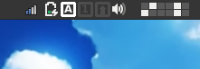
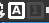

# xfce4-kind-plugin
A keyboard indicator for your xfce4-panel

### Screenshots
Pretty screenshots!

----

### Homepage

[Xfce4-kind-plugin repository](https://github.com/ru2saig/xfce4-kind-plugin/)

### Source Code Repository

[Xfce4-kind-plugin source code](https://github.com/ru2saig/xfce4-kind-plugin/)

### Dependencies
- Xfce4 panel 4.16
- libxfce4util-dev 4.16
- libxfce4panel-2.0-dev 4.16

### Installation
From source code repository: 

    % git clone https://github.com/ru2saig/xfce4-kind-plugin.git
    % cd xfce4-kind-plugin
    % ./autogen.sh
	% ./configure --prefix=/usr/
    % make
    % sudo make install
    % xfce4-panel --add=kind

### Attribution
For the icon: https://iconarchive.com/show/keyboard-keys-icons-by-chromatix.1.html

### Reporting Bugs
Open a new issue
