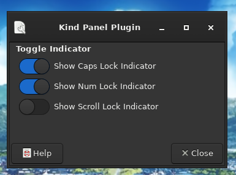

# xfce4-kind-plugin
A keyboard indicator for your xfce4-panel

### Screenshots
Pretty screenshots!

----

### Homepage

[Xfce4-kind-plugin repository](https://github.com/ru2saig/xfce4-kind-plugin/)

### Source Code Repository

[Xfce4-kind-plugin source code](https://github.com/ru2saig/xfce4-kind-plugin/)

### Dependencies
- Xfce4 panel 4.16
- libxfce4util-dev 4.16
- libxfce4panel-2.0-dev 4.16
- xfce4-dev-tools

### Installation
From source code repository: 

    % git clone https://github.com/ru2saig/xfce4-kind-plugin.git
    % cd xfce4-kind-plugin
    % ./autogen.sh
    % ./configure --prefix=/usr/ # --libdir=/usr/lib64
    % make
    % sudo make install
    % xfce4-panel --add=kind

*Note:* For multilib systems, use /usr/lib64 as the plugin installation directory. In that case, uncomment the libdir option in the configure line.

### Attribution
Icons from [Qogir-icon-theme](https://github.com/vinceliuice/Qogir-icon-theme)
Distributed under GPL-3.0.

### Reporting Bugs
Open a new issue

### Further Exploration
#### xfce4-panel 
- https://docs.xfce.org/contribute/dev/start
- https://wiki.xfce.org/xfce4-panel/dev <-- if you would like to write your own plugins
- https://docs.xfce.org/panel-plugins/xfce4-sample-plugin/start <-- used as the biolerplate code
- https://docs.xfce.org/panel-plugins/xfce4-pulseaudio-plugin/start
- https://docs.xfce.org/panel-plugins/start <-- all the panel plugins
#### Gtk
- https://book.huihoo.com/gtk+-gnome-application-development/ggad.html
- https://www.cc.gatech.edu/data_files/public/doc/gtk/tutorial/gtk_tut.html
- https://zetcode.com/gui/gtk2/
- https://glade.gnome.org/ <-- used to create the Properties/Settings Dialog
